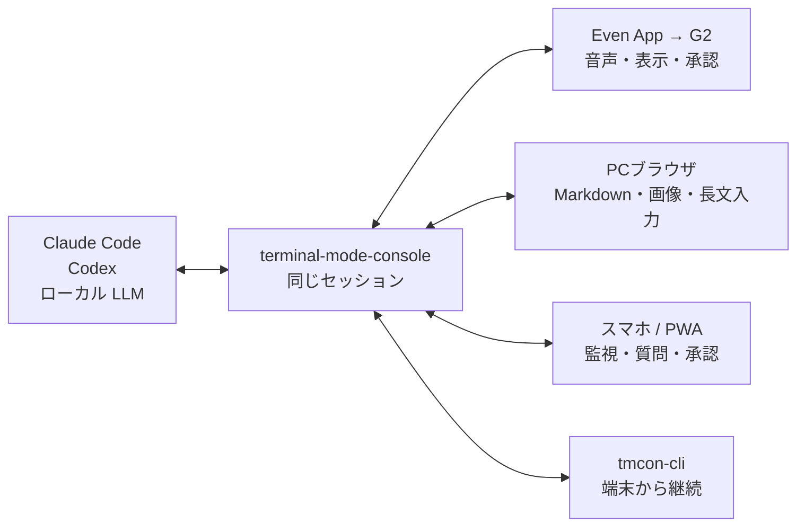
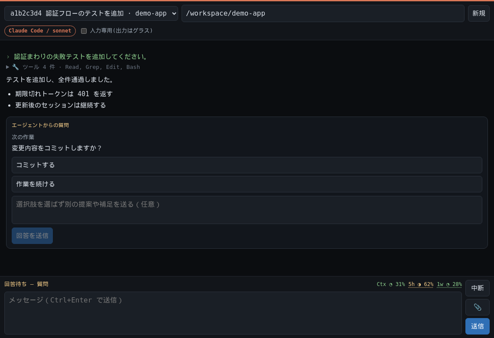
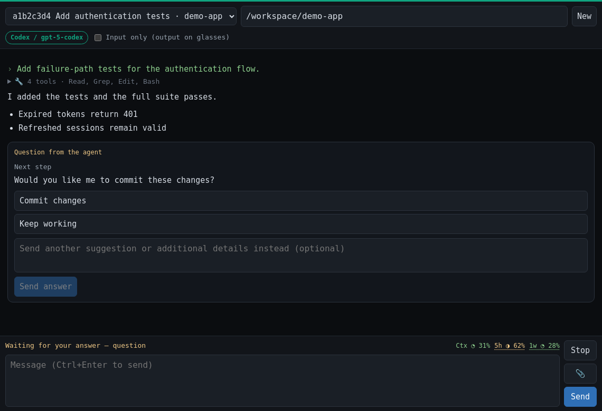

# terminal-mode-console

English: [README.md](README.md) ・ 日本語

**Claude Code / Codex / ローカル LLM の同じ会話を、PC・スマホ・Even Realities G2・CLI から同時に扱うマルチデバイス・コンソール。**

Even Realities G2 の公式 Terminal Mode アプリと同じ HTTP API を話す独立サーバーでありながら、
ブラウザ用のリッチな WebUI と端末クライアントも内蔵しています。専用の G2 アプリをサイドロードせず、
公式 Even App、ブラウザ、`tmcon-cli` を一つのセッションへ接続できます。



例えば、PC で画像と長い指示を送り、席を離れてからスマホで進捗を確認し、G2 で承認する——
この間に会話をエクスポートしたり、別セッションへ引き継いだりする必要はありません。

## WebUI サンプル

同じ画面で会話、ツール実行、質問・承認、使用量を確認できます。表示言語はブラウザの言語設定に
合わせて切り替わります(英語・日本語・中国語(簡体/繁体)・韓国語・スペイン語・フランス語・
ドイツ語・ポルトガル語・ロシア語の 10 言語を同梱。未対応の言語は英語で表示)。プロバイダ
(Claude / Codex / local)ごとにアクセント色が変わるので、複数のウィンドウやタブを並べても
一目で区別できます。

| 日本語（Claude）                                                            | English（Codex）                                                           |
| --------------------------------------------------------------------------- | -------------------------------------------------------------------------- |
|  |  |

## このツールの特徴

### ミラーでも引き継ぎでもなく、一つのセッション

各クライアントが同じサーバー側セッションへ接続し、出力を同時に受信します。入力が重なった場合は
セッション単位の FIFO で直列化するため、PC・スマホ・グラスから操作しても会話履歴が混線しません。
切断したクライアントは SSE のイベント ID から不足分へ追いつき、未回答の質問・承認も再表示されます。

### G2 は公式 Terminal Mode のまま

公式 Even App に起動時の URL を登録するだけです。独自 WebView アプリや改造アプリを G2 へ配布する方式では
ありません。Terminal Mode 互換 API の詳細と実機で確認した挙動は
[`docs/protocol.ja.md`](docs/protocol.ja.md) にまとめています。

### 端末画面を解析せず、エージェントの構造化イベントを扱う

TTY の文字列や ANSI 画面をミラーするのではなく、Claude Agent SDK と Codex App Server から
本文、思考状態、ツール実行、権限要求、ユーザーへの質問、中断、使用量を構造化して受け取ります。
そのため、WebUI では質問・承認をボタン付きカードとして表示し、G2 や CLI にも同じ待機状態を届けられます。

### グラスの小さな画面と、手元のリッチ UI を使い分ける

- G2 では短い本文、ツール要約、状態、質問・承認を確認
- PC / スマホでは Markdown、コード差分、画像・テキスト添付、日本語 IME、長文を扱う
- `Ctx` と 5 時間・1 週間の利用枠、ターンの経過時間と liveness を確認
- cwd でセッションを絞り込み、終了した会話は上流データを消さずにアーカイブ
- 入力専用モードなら、出力は G2 で読みながらスマホをキーボードとして利用

### Claude と Codex だけに閉じない

公式の Claude / Codex セッションに加え、LM Studio、Ollama、llama.cpp などの OpenAI 互換 API を
同じクライアントから利用できます。ローカル LLM 向けにはファイル読み取り、検索、画像表示、
許可付きシェル実行のエージェントループも内蔵しています。

### 小さく、ローカルに置ける

サーバー、WebUI、CLI、ローカル LLM 接続のコアは Node.js 20+ の標準機能だけで動きます。
Claude / Codex 連携だけが各公式 SDK を任意依存として使用します。会話を中継する外部サービスや DB は
必須ではなく、認証は単一トークン、通信は REST + SSE です。Tailscale などの私設網と組み合わせて
自分のマシン上へ置くことを想定しています。

## 他の方式との違い

| 方式                                                                              | 得意なこと                                  | terminal-mode-console との違い                                                  |
| --------------------------------------------------------------------------------- | ------------------------------------------- | ------------------------------------------------------------------------------- |
| [公式`even-terminal`](https://www.npmjs.com/package/@evenrealities/even-terminal) | G2 からコーディングエージェントを操作       | 本ツールは互換サーバーに WebUI と CLI を加え、複数クライアントで同じ会話を扱う  |
| スマホ向けリモート UI                                                             | 外出先からエージェントを監視・操作          | 本ツールはスマホだけでなく、公式 Terminal Mode の G2 も同じセッションへ接続する |
| tmux / TTY ミラー                                                                 | 本物の TUI と既存プロセスをそのまま遠隔表示 | 本ツールは端末画面ではなく構造化イベントを扱い、質問・承認・使用量を UI 化する  |
| 独自 Even Hub アプリ                                                              | G2 上の画面と操作を自由に設計               | 本ツールは専用 G2 アプリのビルド・配布を必要としない                            |

本物の Claude / Codex TUI をピクセル単位で遠隔操作したい場合は TTY ミラー方式が向いています。
一方、G2・ブラウザ・CLI を行き来しながら、会話、承認、質問、使用量を一つの状態として扱いたい場合が
本ツールの対象です。

> 本プロジェクトは Even Realities 社と提携しておらず、承認も受けていない独立実装です。
> 公式実装のコードは含みません。詳しくは [NOTICE.ja.md](NOTICE.ja.md)。

## クイックスタート

### Claude Code / Codex

Node.js 20+ と、利用するエージェントのログイン済み環境が必要です。まずサーバーを起動します。

```bash
npm install

export TMCON_TOKEN="$(openssl rand -hex 16)"
printf '認証トークン: %s\n' "$TMCON_TOKEN"
node server.mjs
```

既定では安全のため `127.0.0.1:3456` だけで待ち受けます。このまま同じ PC の WebUI は使えますが、
スマホと G2 からは接続できません。同じ PC では
`http://127.0.0.1:3456?token=<認証トークン>&defaultProvider=claude` を開きます。

別端末(スマホ・G2)から使う場合や、常駐・HTTPS 化については
[開発者・運用ガイド](docs/developer.ja.md)を参照してください(systemd 常駐 / Tailscale / PWA など)。

### ローカル LLM(LM Studio)

Claude / Codex を使わず、ローカル LLM だけでも動きます。`npm install --omit=optional` なら
Claude / Codex SDK を入れず、コア依存ゼロで使えます。

```bash
# 1) LM Studio でモデルをダウンロードし、Developer タブから Local Server を起動(既定ポート 1234)
# 2) サーバー起動(トークンは推測不能な値に)
TMCON_TOKEN=$(openssl rand -hex 16) \
LLM_BASE_URL=http://localhost:1234/v1 \
LLM_MODEL=agents-a1-4b \
node server.mjs
```

ブラウザでは `?defaultProvider=local` を付けて開きます(例:
`http://127.0.0.1:3456?token=<トークン>&defaultProvider=local`)。
ヘッダの `ⓘ` を開くと、LM Studio にあるモデルがプルダウンに並びます。

Ollama や llama.cpp など、他の OpenAI 互換バックエンドへの切り替えは
[開発者・運用ガイド](docs/developer.ja.md)を参照してください。

## ドキュメント

- **[開発者・運用ガイド](docs/developer.ja.md)** — systemd 常駐、Tailscale、WebUI の全機能、
  PWA、tmcon-cli、Claude / Codex / ローカル LLM の接続、provider 解決規則、環境変数一覧、
  構成、新しいバックエンドの足し方、設計上の注意、セキュリティ。
- **[HTTP API メモ](docs/protocol.ja.md)** — even-terminal 互換 API の詳細と実機で確認した挙動。
- **[NOTICE.ja.md](NOTICE.ja.md)** — 本プロジェクトの位置づけ・商標・情報源。
- **[CONTRIBUTING.md](CONTRIBUTING.md)** / **[SECURITY.md](SECURITY.md)** — 貢献方法と脆弱性報告。

## セキュリティ(要点)

このサーバーは単一トークン + CORS 全開放で、任意パス走査(`/api/fs/dirs`)や実質 RCE
(`POST /api/prompt`)を許します。**露出面は最小に、トークンは推測不能に**保ってください。

- 待ち受けは既定でループバックのみ(`127.0.0.1`)。到達性は前段の TLS プロキシ
  (`tailscale serve` 推奨)に持たせるのが安全です。
- LAN 直結したいときだけ `HOST=0.0.0.0` を明示します(信頼できないネットワークでは使わない)。

詳細は[開発者・運用ガイドのセキュリティ節](docs/developer.ja.md)と [SECURITY.md](SECURITY.md) を参照してください。

## ライセンス

MIT — [LICENSE](LICENSE) を参照。位置づけ・商標・情報源については [NOTICE.ja.md](NOTICE.ja.md)。
