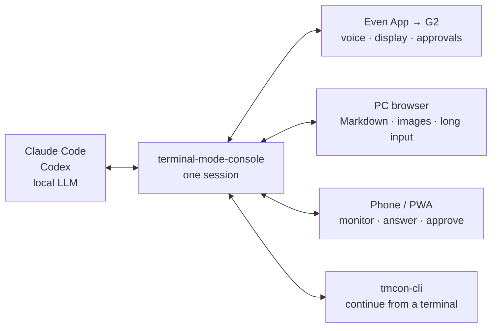

# terminal-mode-console

[English] ・ 日本語: [README.ja.md](README.ja.md)

**A multi-device console that drives one shared Claude Code / Codex / local-LLM
conversation from your PC, phone, Even Realities G2, and CLI at the same time.**

It is an independent server that speaks the same HTTP API as the official Even
Realities G2 Terminal Mode app, while also bundling a rich browser WebUI and a
terminal client. There is no custom G2 app to sideload: the official Even App,
your browser, and `tmcon-cli` all connect to a single session.



For example: send an image and a long instruction from your PC, step away and
check progress on your phone, then approve on the G2 — all without exporting the
conversation or handing it off to a different session.

## WebUI

One screen shows the conversation, tool runs, questions/approvals, and usage.
The display language follows your browser's language setting (ten languages ship
in the box — English, Japanese, Chinese (Simplified and Traditional), Korean,
Spanish, French, German, Portuguese, and Russian; unsupported languages fall
back to English). Each
provider (Claude / Codex / local) gets its own accent color, so you can tell
several windows or tabs apart at a glance.

| 日本語 (Claude)                                                              | English (Codex)                                                            |
| ---------------------------------------------------------------------------- | -------------------------------------------------------------------------- |
|  |  |

## Features

### One session — not a mirror, not a handoff

Every client connects to the same server-side session and receives output
simultaneously. Overlapping input is serialized with a per-session FIFO, so
driving the conversation from PC, phone, and glasses never interleaves the
history. A client that reconnects catches up from the SSE event ID, and any
unanswered question or approval is re-presented.

### The G2 stays on official Terminal Mode

You only register the startup URL in the official Even App. Nothing is a custom
WebView or modified app distributed to the G2. The Terminal Mode-compatible API
and the behaviors verified on real hardware are documented in
[`docs/protocol.md`](docs/protocol.md).

### Structured agent events, not screen scraping

Instead of mirroring TTY text or an ANSI screen, it receives structured events —
body text, thinking state, tool runs, permission requests, questions to the
user, interrupts, and usage — from the Claude Agent SDK and the Codex App
Server. That lets the WebUI render questions and approvals as cards with
buttons, and deliver the same waiting state to the G2 and CLI.

### The small glasses screen and the rich local UI, each for what it's good at

- On the G2: short body text, tool summaries, state, and questions/approvals.
- On PC/phone: Markdown, code diffs, image and text attachments, a Japanese IME,
  and long-form input.
- See `Ctx` and the 5-hour / 1-week usage windows, plus per-turn elapsed time
  and liveness.
- Filter sessions by cwd, and archive finished conversations without touching
  upstream data.
- Input-only mode lets you read output on the G2 while using the phone as a
  keyboard.

### Not limited to Claude and Codex

Alongside official Claude / Codex sessions, you can use any OpenAI-compatible API
(LM Studio, Ollama, llama.cpp, …) from the same clients. The local-LLM path
includes a built-in agent loop with file reading, search, image viewing, and
permission-gated shell execution.

### Small, and yours to self-host

The core — server, WebUI, CLI, and local-LLM connectivity — runs on the Node.js
20+ standard library alone. Only the Claude / Codex integrations pull in their
official SDKs, as optional dependencies. No external relay service or database is
required; authentication is a single token and transport is REST + SSE. It is
meant to live on your own machine, combined with a private network such as
Tailscale.

## How it differs from other approaches

| Approach                                                                               | Good at                                             | How terminal-mode-console differs                                                              |
| -------------------------------------------------------------------------------------- | --------------------------------------------------- | ---------------------------------------------------------------------------------------------- |
| [Official `even-terminal`](https://www.npmjs.com/package/@evenrealities/even-terminal) | Driving a coding agent from the G2                  | Adds a WebUI and CLI to a compatible server, so many clients share one conversation            |
| Phone-oriented remote UIs                                                              | Monitoring/operating an agent while away            | Connects not just the phone but also the official Terminal Mode G2 to the same session         |
| tmux / TTY mirrors                                                                     | Remoting a real TUI and existing processes as-is    | Works with structured events, not the terminal screen; turns questions/approvals/usage into UI |
| Custom Even Hub apps                                                                   | Designing the on-glasses screen and controls freely | Requires no custom G2 app to build or distribute                                               |

If you want to remotely drive a real Claude / Codex TUI pixel-for-pixel, a TTY
mirror suits you better. This tool is for treating the conversation, approvals,
questions, and usage as one shared state while you move between the G2, browser,
and CLI.

> This project is an independent implementation, not affiliated with or endorsed
> by Even Realities. It contains no official implementation code. See
> [NOTICE.md](NOTICE.md) for details.

## Quick start

### Claude Code / Codex

You need Node.js 20+ and a logged-in environment for the agent you want to use.
Start the server first:

```bash
npm install

export TMCON_TOKEN="$(openssl rand -hex 16)"
printf 'auth token: %s\n' "$TMCON_TOKEN"
node server.mjs
```

By default it listens only on `127.0.0.1:3456` for safety. The WebUI works on
the same PC as-is, but phones and the G2 cannot reach it yet. On the same PC,
open `http://127.0.0.1:3456?token=<auth token>&defaultProvider=claude`.

To reach the server from another device (phone, G2), or to run it as a service
and put HTTPS in front, see the
[Developer & Operations Guide](docs/developer.md) (systemd, Tailscale, PWA, and
more).

### Local LLM (LM Studio)

You can run without Claude / Codex at all. `npm install --omit=optional` skips
the Claude / Codex SDKs and keeps the core dependency-free.

```bash
# 1) Download a model in LM Studio and start the Local Server from the Developer
#    tab (default port 1234)
# 2) Start the server (use an unguessable token)
TMCON_TOKEN=$(openssl rand -hex 16) \
LLM_BASE_URL=http://localhost:1234/v1 \
LLM_MODEL=agents-a1-4b \
node server.mjs
```

In the browser, open it with `?defaultProvider=local` (e.g.
`http://127.0.0.1:3456?token=<token>&defaultProvider=local`).
Opening the header's `ⓘ` lists the models available in LM Studio.

For other OpenAI-compatible backends (Ollama, llama.cpp), see the
[Developer & Operations Guide](docs/developer.md).

## Documentation

- **[Developer & Operations Guide](docs/developer.md)** — running as a service
  (systemd), Tailscale, the full WebUI feature set, PWA, `tmcon-cli`, connecting
  Claude / Codex / local LLMs, the provider resolution rules, the full
  environment-variable reference, project layout, adding a new backend, design
  notes, and security.
- **[HTTP API notes](docs/protocol.md)** — the even-terminal-compatible API and
  behaviors verified on real hardware.
- **[NOTICE.md](NOTICE.md)** — this project's positioning, trademarks, and
  information sources.
- **[CONTRIBUTING.md](CONTRIBUTING.md)** / **[SECURITY.md](SECURITY.md)** — how
  to contribute and how to report vulnerabilities.

## Security (in brief)

This server uses a single token and fully-open CORS, and it allows arbitrary
path traversal (`/api/fs/dirs`) and effectively RCE (`POST /api/prompt`). **Keep
the exposed surface minimal and the token unguessable.**

- It listens on loopback only (`127.0.0.1`) by default. Prefer terminating TLS
  at a front proxy (`tailscale serve` recommended) for reachability.
- Only set `HOST=0.0.0.0` when you deliberately want a direct LAN bind; never do
  so on an untrusted network.

For details, see the security section of the
[Developer & Operations Guide](docs/developer.md) and [SECURITY.md](SECURITY.md).

## License

MIT — see [LICENSE](LICENSE). For positioning, trademarks, and information
sources, see [NOTICE.md](NOTICE.md).
